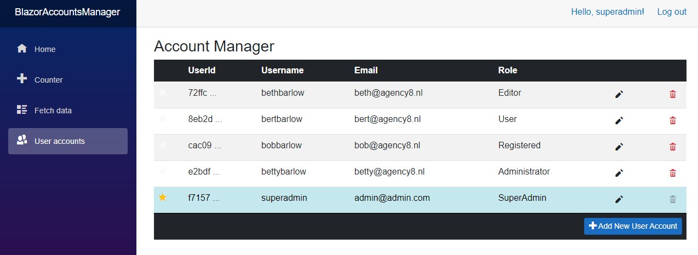
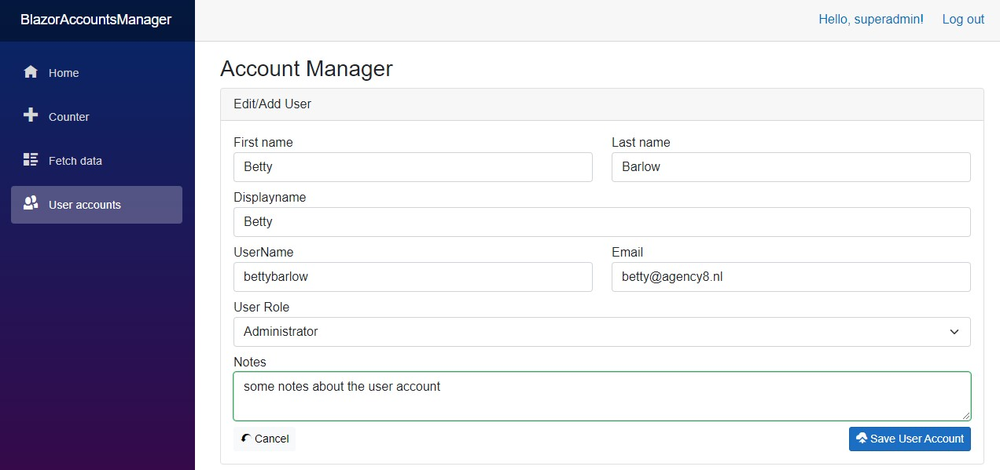

# Blazor 6 client User Manager Demo
This is a demo to show how to setup and manager users and their roles on the client side.

### Features:
- **Client side User Manager**
- Uses **Microsoft Identity** (NOT IdentityServer)
-	A complete UI to manager user accounts
-	Uses **JWT** for authentication
-	**Policy based** roles and authentication
-	You can Add, edit, delete and change the user’s role.
-	**Custom Database table names** (Users, Roles etc., instead of the standard AspNetUsers, AspNetRoles)
-	**Custom fields** added to the ‘ApplicationUser’ table (FirstName, LastName, DisplayName, Notes)
-	Registration, Login and logout pages (client side)
-	Can be **easily expanded** with extra user account fields etc.
-	Added a simple **ToolTips Component** for ease of use
---

### Setup Instructions

The access role to use the ‘User Account’ page is ‘SuperAdmin’, this is needed.
Change your database connection in the ‘appsettings.json’ file (sqlConnection))
Create a secret key for JwtSecurityKey, this can be a Guid or anything you like

`"JwtSecurityKey": "ADD_A_NEW_SECURITY_KEY_HERE"`

Change the ‘JwtIssuer’ and ‘JwtAudience’ to match your site.
Using the ‘Package Manager Console’ or preferred way, create a migration:
Make sure you are in the right directory:

-	`cd blazoraccountsmanager` 
-	`cd server`

Create a migration

-	`dotnet ef migrations add InitialCreate`

Update the database

-	`dotnet ef database update`

Once you have created the database via EntityFramework, you should be able to run the app and login with the pre-filled user account below:

**Username** : superadmin
**Password**: Admin*123

